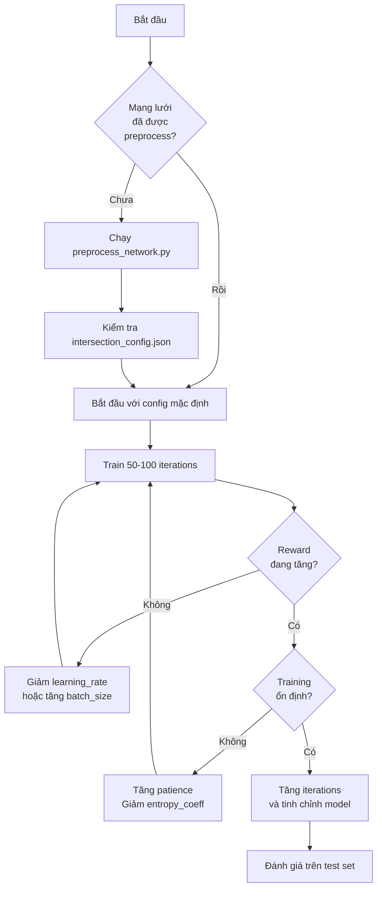

# Hướng Dẫn Tinh Chỉnh Tham Số MGMQ-PPO

Tài liệu này cung cấp hướng dẫn chi tiết về tất cả các tham số có thể tinh chỉnh trong hệ thống MGMQ-PPO cho bài toán điều khiển đèn tín hiệu giao thông thích ứng.

---

## Mục Lục

1. [Tổng Quan](#1-tổng-quan)
2. [Tham Số Training (PPO)](#2-tham-số-training-ppo)
3. [Tham Số Model MGMQ](#3-tham-số-model-mgmq)
4. [Tham Số Environment (SUMO)](#4-tham-số-environment-sumo)
5. [Tham Số Preprocessing](#5-tham-số-preprocessing)
6. [Hướng Dẫn Tinh Chỉnh Theo Scenario](#6-hướng-dẫn-tinh-chỉnh-theo-scenario)
7. [Best Practices](#7-best-practices)

---

## 1. Tổng Quan

Hệ thống MGMQ-PPO có 4 nhóm tham số chính cần được tinh chỉnh:

```
┌─────────────────────────────────────────────────────────────┐
│                    MGMQ-PPO System                          │
├─────────────────────────────────────────────────────────────┤
│  ┌─────────────┐  ┌─────────────┐  ┌────────────────────┐  │
│  │  Training   │  │    Model    │  │   Environment      │  │
│  │   (PPO)     │──│   (MGMQ)    │──│     (SUMO)         │  │
│  └─────────────┘  └─────────────┘  └────────────────────┘  │
│         ▲                                      ▲            │
│         │           ┌─────────────┐            │            │
│         └───────────│Preprocessing│────────────┘            │
│                     │ (GPI+FRAP)  │                         │
│                     └─────────────┘                         │
└─────────────────────────────────────────────────────────────┘
```

---

## 2. Tham Số Training (PPO)

### 2.1. Tham Số Huấn Luyện Cơ Bản

| Tham số | CLI Flag | Mặc định | Ý nghĩa | Phạm vi khuyến nghị |
|---------|----------|----------|---------|---------------------|
| `num_iterations` | `--iterations` | 200 | Số iteration training | 100 - 1000 |
| `num_workers` | `--workers` | 2 | Số worker song song | 1 - 8 (tùy CPU) |
| `checkpoint_interval` | `--checkpoint-interval` | 20 | Lưu checkpoint mỗi N iterations | 10 - 50 |
| `patience` | `--patience` | 50 | Early stopping sau N iter không cải thiện | 30 - 100 |
| `seed` | `--seed` | 42 | Random seed | Bất kỳ số nguyên |

#### Chi tiết từng tham số:

**`num_iterations`**
- **Ý nghĩa**: Số lần lặp huấn luyện. Mỗi iteration bao gồm việc thu thập dữ liệu từ môi trường và cập nhật mạng nơ-ron.
- **Cách hoạt động**: Tăng số iterations giúp model hội tụ tốt hơn nhưng tốn nhiều thời gian hơn.
- **Tinh chỉnh**:
  - Mạng lưới nhỏ (4x4): 100-200 iterations
  - Mạng lưới lớn (nhiều ngã tư): 300-500 iterations
  - Nếu reward vẫn đang tăng ở cuối training, tăng thêm iterations

**`num_workers`**
- **Ý nghĩa**: Số môi trường SUMO chạy song song để thu thập dữ liệu.
- **Cách hoạt động**: Nhiều worker = thu thập dữ liệu nhanh hơn nhưng tốn nhiều RAM/CPU.
- **Tinh chỉnh**:
  - Máy yếu (8GB RAM): 1-2 workers
  - Máy trung bình (16GB RAM): 2-4 workers
  - Máy mạnh (32GB+ RAM): 4-8 workers
  
> [!WARNING]
> Mỗi worker cần ~500MB RAM. Nếu gặp lỗi memory, giảm số workers.

**`patience`**
- **Ý nghĩa**: Số iterations liên tiếp không có cải thiện reward trước khi dừng sớm.
- **Cách hoạt động**: Ngăn chặn overfitting và tiết kiệm thời gian.
- **Tinh chỉnh**:
  - Nếu training dừng quá sớm: tăng patience lên 80-100
  - Nếu muốn thử nghiệm nhanh: giảm xuống 20-30

### 2.2. Tham Số PPO Algorithm

Các tham số này được cấu hình trong `create_mgmq_ppo_config()`:

| Tham số | CLI Flag | Mặc định | Ý nghĩa |
|---------|----------|----------|---------|
| `learning_rate` | `--learning-rate` | 3e-4 | Tốc độ học |
| `gamma` | - | 0.99 | Discount factor |
| `lambda_` | - | 0.95 | GAE lambda |
| `entropy_coeff` | - | 0.01 | Hệ số entropy |
| `clip_param` | - | 0.2 | PPO clip parameter |

#### Chi tiết:

**`learning_rate`**
- **Ý nghĩa**: Tốc độ cập nhật trọng số mạng nơ-ron.
- **Cách hoạt động**: Giá trị nhỏ → học chậm nhưng ổn định, giá trị lớn → học nhanh nhưng có thể không hội tụ.
- **Tinh chỉnh**:
  ```
  Quá chậm (reward không tăng): Tăng lên 5e-4 hoặc 1e-3
  Không ổn định (reward dao động mạnh): Giảm xuống 1e-4 hoặc 5e-5
  ```

**`gamma` (Discount Factor)**
- **Ý nghĩa**: Mức độ quan trọng của reward tương lai so với reward hiện tại.
- **Cách hoạt động**: 
  - γ = 0.99: Agent quan tâm nhiều đến phần thưởng xa (tốt cho traffic control)
  - γ = 0.9: Agent quan tâm nhiều hơn đến phần thưởng gần
- **Tinh chỉnh**: Giữ nguyên 0.99 cho traffic control (đây là bài toán cần tầm nhìn dài hạn)

**`entropy_coeff`**
- **Ý nghĩa**: Khuyến khích sự đa dạng trong hành động (exploration).
- **Cách hoạt động**: 
  - Cao (0.05-0.1): Agent thử nhiều hành động khác nhau
  - Thấp (0.001): Agent hội tụ nhanh hơn về một policy
- **Tinh chỉnh**:
  ```
  Training ban đầu: 0.01-0.02 (exploration)
  Fine-tuning: 0.001-0.005 (exploitation)
  ```

**`clip_param`**
- **Ý nghĩa**: Giới hạn mức độ thay đổi policy mỗi lần update.
- **Cách hoạt động**: Ngăn chặn update quá lớn gây destabilization.
- **Tinh chỉnh**: Thường giữ 0.2 (giá trị chuẩn của PPO)

### 2.3. Tham Số Batch Size

| Tham số | Mặc định | Ý nghĩa |
|---------|----------|---------|
| `train_batch_size` | 256 | Tổng số samples cho mỗi update |
| `minibatch_size` | 32 | Kích thước minibatch cho SGD |
| `num_sgd_iter` | 10 | Số epochs trên mỗi batch |
| `rollout_fragment_length` | 20 | Số steps thu thập trước khi gửi về |

**Tinh chỉnh batch size**:
- Mạng lưới nhỏ: `train_batch_size=128`, `minibatch_size=16`
- Mạng lưới lớn: `train_batch_size=512`, `minibatch_size=64`

> [!TIP]
> `rollout_fragment_length=20` phù hợp với traffic control vì mỗi episode chỉ có ~40 steps (với `num_seconds=3600` và `delta_time=90`)

---

## 3. Tham Số Model MGMQ

### 3.1. Tham Số GAT Layer (Intersection Embedding)

| Tham số | CLI Flag | Mặc định | Ý nghĩa |
|---------|----------|----------|---------|
| `gat_hidden_dim` | `--gat-hidden-dim` | 256 | Dimension ẩn của GAT |
| `gat_output_dim` | `--gat-output-dim` | 128 | Dimension output mỗi head |
| `gat_num_heads` | `--gat-num-heads` | 4 | Số attention heads |

#### Chi tiết:

**`gat_hidden_dim`**
- **Ý nghĩa**: Kích thước không gian ẩn cho mỗi làn đường sau projection.
- **Cách hoạt động**: 
  - Input: 4 features/lane (density, queue, occupancy, speed)
  - Sau projection: `gat_hidden_dim` features/lane
- **Tinh chỉnh**:
  ```
  Mạng lưới đơn giản: 32
  Mạng lưới phức tạp: 64-128
  Nếu overfitting (train tốt, test kém): giảm xuống
  ```

**`gat_num_heads`**
- **Ý nghĩa**: Số cơ chế attention độc lập học các mối quan hệ khác nhau.
- **Cách hoạt động**: 
  - Mỗi head học một "góc nhìn" khác về quan hệ giữa các lanes
  - Output được concatenate: `total_output = gat_output_dim * gat_num_heads`
- **Tinh chỉnh**:
  - 2-4 heads cho bài toán traffic (đủ để học conflict/cooperation)
  - Không nên quá 8 heads (overly complex)

**`gat_output_dim`**
- **Ý nghĩa**: Dimension output của mỗi attention head.
- **Tinh chỉnh**: Tổng dimension = `gat_output_dim * gat_num_heads` nên vào khoảng 64-256

### 3.2. Tham Số GraphSAGE Layer (Spatial Aggregation)

| Tham số | CLI Flag | Mặc định | Ý nghĩa |
|---------|----------|----------|---------|
| `graphsage_hidden_dim` | `--graphsage-hidden-dim` | 256 | Dimension ẩn của GraphSAGE |

**`graphsage_hidden_dim`**
- **Ý nghĩa**: Kích thước embedding sau khi tổng hợp thông tin từ các ngã tư lân cận.
- **Cách hoạt động**: GraphSAGE aggregates features từ neighbors → transform → output
- **Tinh chỉnh**:
  ```
  Mạng lưới 4x4: 32-64
  Mạng lưới lớn (8x8 trở lên): 64-128
  ```

### 3.3. Tham Số Bi-GRU (Temporal Processing)

| Tham số | CLI Flag | Mặc định | Ý nghĩa |
|---------|----------|----------|---------|
| `gru_hidden_dim` | `--gru-hidden-dim` | 128 | Dimension ẩn của GRU |
| `history_length` | `--history-length` | 4 | Độ dài chuỗi thời gian |

**`gru_hidden_dim`**
- **Ý nghĩa**: Kích thước bộ nhớ của GRU để lưu trữ thông tin temporal.
- **Tinh chỉnh**:
  - 16-32: cho `history_length` ngắn (1-3)
  - 32-64: cho `history_length` dài hơn (5-10)

**`history_length` (window_size)**
- **Ý nghĩa**: Số bước thời gian lịch sử được xem xét.
- **Cách hoạt động**:
  - `history_length=1`: Không dùng temporal (chỉ trạng thái hiện tại)
  - `history_length>1`: Model học patterns theo thời gian
- **Tinh chỉnh**:
  ```
  Bắt đầu: history_length=1 (đơn giản hơn để debug)
  Nâng cao: history_length=5-10 (để học xu hướng traffic)
  ```

> [!IMPORTANT]
> `history_length > 1` sẽ tăng kích thước observation và thời gian training đáng kể.

### 3.4. Tham Số Policy/Value Networks

| Tham số | Mặc định | Ý nghĩa |
|---------|----------|---------|
| `policy_hidden_dims` | [128, 64] | Kiến trúc policy network |
| `value_hidden_dims` | [128, 64] | Kiến trúc value network |
| `dropout` | 0.3 | Tỷ lệ dropout |

**`dropout`**
- **Ý nghĩa**: Tỷ lệ neurons bị tắt trong training để chống overfitting.
- **Tinh chỉnh**:
  - 0.1-0.2: Mạng lưới nhỏ
  - 0.3-0.5: Mạng lưới lớn hoặc có nhiều dữ liệu

---

## 4. Tham Số Environment (SUMO)

### 4.1. Tham Số Thời Gian Mô Phỏng

| Tham số | Mặc định | Ý nghĩa |
|---------|----------|---------|
| `num_seconds` | 8000 | Thời gian mô phỏng (giây) |
| `begin_time` | 0 | Thời điểm bắt đầu (giây) |
| `delta_time` | 5 | Delta time chính (giây) |
| `cycle_time` | 90 | Chu kỳ đèn (giây) |

**`num_seconds`**
- **Ý nghĩa**: Độ dài một episode (giây thực trong simulation).
- **Cách hoạt động**: Episode kết thúc khi đạt `num_seconds`.
- **Tinh chỉnh**:
  ```
  Training nhanh: 1800-3600 (30-60 phút mô phỏng)
  Evaluation đầy đủ: 7200-14400 (2-4 giờ mô phỏng)
  Peak hour testing: Chọn begin_time tương ứng giờ cao điểm
  ```

**`cycle_time`**
- **Ý nghĩa**: Tổng thời gian một chu kỳ đèn (tất cả các pha).
- **Tinh chỉnh**:
  - Giao lộ đơn giản (2 pha): 60-90 giây
  - Giao lộ phức tạp (4+ pha): 90-120 giây
  - Lưu lượng cao: tăng cycle_time để giảm số lần chuyển pha

### 4.2. Tham Số Điều Khiển Đèn

| Tham số | Mặc định | Ý nghĩa |
|---------|----------|---------|
| `yellow_time` | 3 | Thời gian đèn vàng (giây) |
| `min_green` | 15 | Thời gian xanh tối thiểu (giây) |
| `max_green` | 90 | Thời gian xanh tối đa (giây) |

**`yellow_time`**
- **Ý nghĩa**: Thời gian đèn vàng cố định giữa các pha.
- **Tinh chỉnh**: Thường 3 giây theo quy chuẩn. Có thể tăng lên 4-5 giây cho đường lớn.

**`min_green` và `max_green`**
- **Ý nghĩa**: Ràng buộc thời gian xanh cho mỗi pha.
- **Tinh chỉnh**:
  ```
  min_green: 
    - Tối thiểu 3-5 giây để xe có thể đi qua
    - Tăng lên 7-10 giây nếu có người đi bộ
    
  max_green:
    - 45-60 giây cho đường bình thường
    - 60-90 giây cho đường chính
  ```

> [!CAUTION]
> Đảm bảo: `min_green * num_phases + yellow_time * num_phases < cycle_time`

### 4.3. Tham Số SUMO

| Tham số | Mặc định | Ý nghĩa |
|---------|----------|---------|
| `time_to_teleport` | 300 | Teleport xe kẹt sau N giây |
| `max_depart_delay` | -1 | Hủy xe không xuất phát được |
| `waiting_time_memory` | 1000 | Thời gian nhớ waiting time |

**`time_to_teleport`**
- **Ý nghĩa**: Nếu xe bị kẹt (không di chuyển) sau N giây, SUMO sẽ teleport xe đó.
- **Tinh chỉnh**:
  - 120-300 giây: Cho phép kẹt xe tự nhiên
  - -1: Tắt teleport (xe kẹt vĩnh viễn - không khuyến nghị)
  
> [!WARNING]
> `time_to_teleport=-1` có thể gây deadlock trong simulation.

---

## 5. Tham Số Preprocessing

### 5.1. Tham Số GPI (Lane Aggregation)

Được cấu hình trong `simulation.yml`:

```yaml
preprocessing:
  gpi:
    lane_aggregation:
      standard_lanes_per_direction: 2
      missing_lane_strategy: "zero"
      merge_strategy: "mean"
```

| Tham số | Mặc định | Ý nghĩa |
|---------|----------|---------|
| `standard_lanes_per_direction` | 2 | Số làn chuẩn hóa mỗi hướng |
| `missing_lane_strategy` | "zero" | Xử lý làn thiếu |
| `merge_strategy` | "mean" | Cách gộp làn thừa |

**`standard_lanes_per_direction`**
- **Ý nghĩa**: Số làn xe được chuẩn hóa cho mỗi hướng (N/E/S/W).
- **Tinh chỉnh**:
  - 2: Cho mạng lưới đơn giản (grid)
  - 3: Cho mạng lưới có đường lớn (major arterials)

**`merge_strategy`**
- **Các lựa chọn**:
  - `"mean"`: Trung bình features các làn (khuyến nghị)
  - `"max"`: Lấy giá trị lớn nhất
  - `"sum"`: Cộng tổng

### 5.2. Tham Số FRAP (Phase Standardization)

```yaml
preprocessing:
  frap:
    standard_pattern: "4phase"
```

| Tham số | Mặc định | Ý nghĩa |
|---------|----------|---------|
| `standard_pattern` | "4phase" | Pattern pha chuẩn |

**`standard_pattern`**
- `"4phase"`: 4 pha chuẩn (NS-left, NS-through, EW-left, EW-through)
- `"2phase"`: 2 pha đơn giản (NS, EW)

---

## 6. Hướng Dẫn Tinh Chỉnh Theo Scenario

### 6.1. Mạng Lưới Nhỏ (Grid 4x4)

```bash
python scripts/train_mgmq_ppo.py \
  --network grid4x4 \
  --iterations 200 \
  --workers 2 \
  --gat-hidden-dim 32 \
  --gat-num-heads 4 \
  --graphsage-hidden-dim 32 \
  --gru-hidden-dim 16 \
  --learning-rate 3e-4 \
  --history-length 1
```

### 6.2. Mạng Lưới Lớn (Zurich, Real-world)

```bash
python scripts/train_mgmq_ppo.py \
  --network zurich \
  --iterations 500 \
  --workers 4 \
  --gat-hidden-dim 64 \
  --gat-num-heads 4 \
  --graphsage-hidden-dim 64 \
  --gru-hidden-dim 32 \
  --learning-rate 1e-4 \
  --patience 80 \
  --history-length 5
```

### 6.3. Luồng Giao Thông Cao (High Traffic)

```bash
python scripts/train_mgmq_ppo.py \
  --network grid4x4 \
  --iterations 300 \
  --learning-rate 1e-4 \
  --patience 100 \
  --history-length 5
```

**Lưu ý cho High Traffic:**
- Tăng `time_to_teleport` lên 300-600 giây
- Giảm `learning_rate` để ổn định hơn
- Tăng `history_length` để học patterns tắc nghẽn

### 6.4. Fine-tuning Model Đã Có

```bash
python scripts/train_mgmq_ppo.py \
  --network grid4x4 \
  --iterations 100 \
  --learning-rate 1e-5 \
  --patience 30 \
  --checkpoint-interval 10
```

---

## 7. Best Practices

### 7.1. Quy Trình Tinh Chỉnh Khuyến Nghị



### 7.2. Monitoring Metrics

Các metrics quan trọng cần theo dõi:

1. **episode_reward_mean**: Reward trung bình - nên tăng dần
2. **episode_len_mean**: Độ dài episode - nên ổn định
3. **policy_loss**: Policy loss - nên giảm rồi ổn định
4. **vf_loss**: Value function loss - nên giảm
5. **entropy**: Entropy - nên giảm từ từ (không quá nhanh)

### 7.3. Debugging Common Issues

| Vấn đề | Nguyên nhân có thể | Giải pháp |
|--------|-------------------|-----------|
| Reward không tăng | Learning rate quá cao/thấp | Thử điều chỉnh learning rate |
| Reward dao động mạnh | Training không ổn định | Giảm learning rate, tăng batch size |
| Memory error | Quá nhiều workers | Giảm workers hoặc tăng RAM |
| SUMO crashed | Timeout hoặc config sai | Kiểm tra network files |
| All rewards = 0 | Detector không hoạt động | Kiểm tra detector.add.xml |

### 7.4. Lưu và Load Checkpoint

```python
# Checkpoint được lưu tự động tại:
# results_mgmq/{experiment_name}/checkpoint_XXXXXX/

# Load checkpoint để tiếp tục training:
# (Sử dụng Ray Tune restore functionality)
```

---

## Phụ Lục: Bảng Tham Chiếu Nhanh

### Command Line Arguments

| Argument | Type | Default | Description |
|----------|------|---------|-------------|
| `--network` | str | grid4x4 | Tên network |
| `--iterations` | int | 200 | Số iterations |
| `--workers` | int | 2 | Số workers |
| `--checkpoint-interval` | int | 20 | Tần suất checkpoint |
| `--reward-threshold` | float | None | Ngưỡng reward để dừng |
| `--experiment-name` | str | None | Tên experiment |
| `--gui` | flag | False | Bật SUMO GUI |
| `--gpu` | flag | False | Sử dụng GPU |
| `--seed` | int | 42 | Random seed |
| `--output-dir` | str | ./results_mgmq | Thư mục output |
| `--gat-hidden-dim` | int | 256 | GAT hidden dim |
| `--gat-output-dim` | int | 128 | GAT output dim |
| `--gat-num-heads` | int | 4 | Số GAT heads |
| `--graphsage-hidden-dim` | int | 256 | GraphSAGE hidden dim |
| `--gru-hidden-dim` | int | 128 | GRU hidden dim |
| `--dropout` | float | 0.3 | Dropout rate |
| `--learning-rate` | float | 3e-4 | Learning rate |
| `--patience` | int | 50 | Early stopping patience |
| `--history-length` | int | 4 | Observation history length |

---
