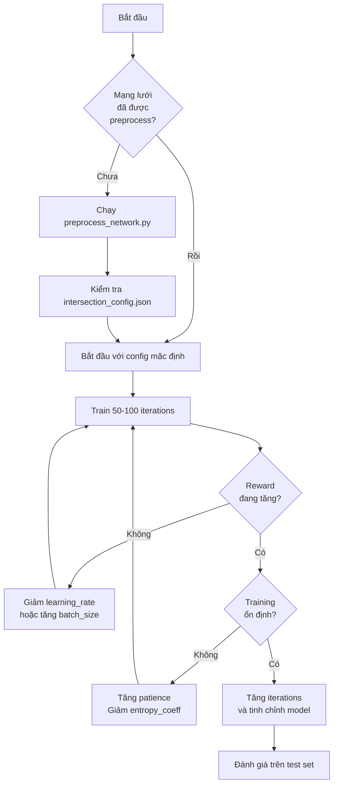

# Hướng Dẫn Tinh Chỉnh Tham Số MGMQ-PPO

Tài liệu này cung cấp hướng dẫn chi tiết về tất cả các tham số có thể tinh chỉnh trong hệ thống MGMQ-PPO cho bài toán điều khiển đèn tín hiệu giao thông thích ứng.

---

## Mục Lục

1. [Tổng Quan](#1-tổng-quan)
2. [Tham Số Training (PPO)](#2-tham-số-training-ppo)
3. [Tham Số Model MGMQ](#3-tham-số-model-mgmq)
4. [Tham Số Environment (SUMO)](#4-tham-số-environment-sumo)
5. [Tham Số Preprocessing](#5-tham-số-preprocessing)
6. [Tham Số Reward](#6-tham-số-reward)
7. [Hướng Dẫn Tinh Chỉnh Theo Scenario](#7-hướng-dẫn-tinh-chỉnh-theo-scenario)
8. [Best Practices](#8-best-practices)

---

## 1. Tổng Quan

Hệ thống MGMQ-PPO có 5 nhóm tham số chính cần được tinh chỉnh:

```
┌─────────────────────────────────────────────────────────────┐
│                    MGMQ-PPO System                          │
├─────────────────────────────────────────────────────────────┤
│  ┌─────────────┐  ┌─────────────┐  ┌────────────────────┐  │
│  │  Training   │  │    Model    │  │   Environment      │  │
│  │   (PPO)     │──│   (MGMQ)    │──│     (SUMO)         │  │
│  └─────────────┘  └─────────────┘  └────────────────────┘  │
│         ▲                ▲                  ▲              │
│         │           ┌────┴────┐             │              │
│         └───────────│ Reward  │─────────────┘              │
│                     └─────────┘                            │
│                          │                                 │
│                 ┌────────┴────────┐                        │
│                 │  Preprocessing  │                        │
│                 │   (GPI+FRAP)    │                        │
│                 └─────────────────┘                        │
└─────────────────────────────────────────────────────────────┘
```

File cấu hình chính: `src/config/model_config.yml`

---

## 2. Tham Số Training (PPO)

### 2.1. Tham Số Huấn Luyện Cơ Bản

| Tham số | Config Key | Mặc định | Ý nghĩa | Phạm vi khuyến nghị |
|---------|------------|----------|---------|---------------------|
| `num_iterations` | `training.num_iterations` | 200 | Số iteration training | 100 - 500 |
| `num_workers` | `training.num_workers` | 2 | Số worker song song | 1 - 8 (tùy CPU) |
| `checkpoint_interval` | `training.checkpoint_interval` | 5 | Lưu checkpoint mỗi N iterations | 5 - 20 |
| `patience` | `training.patience` | 500 | Early stopping sau N iter không cải thiện | 100 - 500 |
| `seed` | `training.seed` | 42 | Random seed | Bất kỳ số nguyên |
| `use_gpu` | `training.use_gpu` | false | Sử dụng GPU | true/false |

#### Chi tiết từng tham số:

**`num_iterations`**
- **Ý nghĩa**: Số lần lặp huấn luyện. Mỗi iteration bao gồm việc thu thập dữ liệu từ môi trường và cập nhật mạng nơ-ron.
- **Tinh chỉnh**:
  - Mạng lưới nhỏ (4x4): 100-200 iterations
  - Mạng lưới lớn (nhiều ngã tư): 300-500 iterations
  - Nếu reward vẫn đang tăng ở cuối training, tăng thêm iterations

**`num_workers`**
- **Ý nghĩa**: Số môi trường SUMO chạy song song để thu thập dữ liệu.
- **Tinh chỉnh**:
  - Máy yếu (8GB RAM): 1-2 workers
  - Máy trung bình (16GB RAM): 2-4 workers
  - Máy mạnh (32GB+ RAM): 4-8 workers
  
> [!WARNING]
> Mỗi worker cần ~500MB RAM. Nếu gặp lỗi memory, giảm số workers.

**`patience`**
- **Ý nghĩa**: Số iterations liên tiếp không có cải thiện reward trước khi dừng sớm.
- **Tinh chỉnh**:
  - Nếu training dừng quá sớm: tăng patience lên 300-500
  - Nếu muốn thử nghiệm nhanh: giảm xuống 50-100

### 2.2. Tham Số PPO Algorithm

| Tham số | Config Key | Mặc định | Ý nghĩa |
|---------|------------|----------|---------|
| `learning_rate` | `ppo.learning_rate` | 0.0008 | Tốc độ học |
| `gamma` | `ppo.gamma` | 0.99 | Discount factor |
| `lambda_` | `ppo.lambda_` | 0.95 | GAE lambda |
| `entropy_coeff` | `ppo.entropy_coeff` | 0.02 | Hệ số entropy |
| `clip_param` | `ppo.clip_param` | 0.2 | PPO clip parameter |
| `vf_clip_param` | `ppo.vf_clip_param` | 10.0 | Value function clip |
| `grad_clip` | `ppo.grad_clip` | 0.5 | Gradient clipping |

#### Chi tiết:

**`learning_rate`**
- **Ý nghĩa**: Tốc độ cập nhật trọng số mạng nơ-ron.
- **Tinh chỉnh**:
  ```
  Quá chậm (reward không tăng): Tăng lên 1e-3 hoặc 2e-3
  Không ổn định (reward dao động mạnh): Giảm xuống 3e-4 hoặc 1e-4
  ```

**`gamma` (Discount Factor)**
- **Ý nghĩa**: Mức độ quan trọng của reward tương lai so với reward hiện tại.
- **Tinh chỉnh**: 
  - γ = 0.99: Agent quan tâm nhiều đến phần thưởng xa (tốt cho traffic control)
  - γ = 0.9: Agent quan tâm nhiều hơn đến phần thưởng gần

**`entropy_coeff`**
- **Ý nghĩa**: Khuyến khích sự đa dạng trong hành động (exploration).
- **Tinh chỉnh**:
  ```
  Training ban đầu: 0.02-0.05 (exploration)
  Fine-tuning: 0.005-0.01 (exploitation)
  ```

**`clip_param`**
- **Ý nghĩa**: Giới hạn mức độ thay đổi policy mỗi lần update.
- **Tinh chỉnh**: Thường giữ 0.2 (giá trị chuẩn của PPO)

### 2.3. Tham Số Batch Size

| Tham số | Config Key | Mặc định | Ý nghĩa |
|---------|------------|----------|---------|
| `train_batch_size` | `ppo.train_batch_size` | 512 | Tổng số samples cho mỗi update |
| `minibatch_size` | `ppo.minibatch_size` | 64 | Kích thước minibatch cho SGD |
| `num_sgd_iter` | `ppo.num_sgd_iter` | 10 | Số epochs trên mỗi batch |

**Tinh chỉnh batch size**:
- Mạng lưới nhỏ: `train_batch_size=256`, `minibatch_size=32`
- Mạng lưới lớn: `train_batch_size=1024`, `minibatch_size=128`

---

## 3. Tham Số Model MGMQ

### 3.1. Tham Số GAT Layer (Intersection Embedding)

| Tham số | Config Key | Mặc định | Ý nghĩa |
|---------|------------|----------|---------|
| `gat_hidden_dim` | `mgmq.gat.hidden_dim` | 128 | Dimension ẩn của GAT |
| `gat_output_dim` | `mgmq.gat.output_dim` | 64 | Dimension output mỗi head |
| `gat_num_heads` | `mgmq.gat.num_heads` | 4 | Số attention heads |

**`gat_hidden_dim`**
- **Ý nghĩa**: Kích thước không gian ẩn cho mỗi làn đường sau projection.
- **Tinh chỉnh**:
  ```
  Mạng lưới đơn giản: 64
  Mạng lưới phức tạp: 128-256
  Nếu overfitting (train tốt, test kém): giảm xuống
  ```

**`gat_num_heads`**
- **Ý nghĩa**: Số cơ chế attention độc lập học các mối quan hệ khác nhau.
- **Tinh chỉnh**:
  - 2-4 heads cho bài toán traffic (đủ để học conflict/cooperation)
  - Không nên quá 8 heads (overly complex)

**`gat_output_dim`**
- **Ý nghĩa**: Dimension output của mỗi attention head.
- **Tinh chỉnh**: Tổng dimension = `gat_output_dim × gat_num_heads` nên vào khoảng 128-256

### 3.2. Tham Số GraphSAGE Layer (Spatial Aggregation)

| Tham số | Config Key | Mặc định | Ý nghĩa |
|---------|------------|----------|---------|
| `graphsage_hidden_dim` | `mgmq.graphsage.hidden_dim` | 128 | Dimension ẩn của GraphSAGE |

**`graphsage_hidden_dim`**
- **Ý nghĩa**: Kích thước embedding sau khi tổng hợp thông tin từ các ngã tư lân cận.
- **Tinh chỉnh**:
  ```
  Mạng lưới 4x4: 64-128
  Mạng lưới lớn (8x8 trở lên): 128-256
  ```

### 3.3. Tham Số Bi-GRU (Temporal Processing)

| Tham số | Config Key | Mặc định | Ý nghĩa |
|---------|------------|----------|---------|
| `gru_hidden_dim` | `mgmq.gru.hidden_dim` | 64 | Dimension ẩn của GRU |
| `history_length` | `mgmq.history_length` | 1 | Độ dài chuỗi thời gian |

**`gru_hidden_dim`**
- **Ý nghĩa**: Kích thước bộ nhớ của GRU để lưu trữ thông tin temporal.
- **Tinh chỉnh**:
  - 32-64: cho `history_length` ngắn (1-3)
  - 64-128: cho `history_length` dài hơn (5-10)

**`history_length` (window_size)**
- **Ý nghĩa**: Số bước thời gian lịch sử được xem xét.
- **Tinh chỉnh**:
  ```
  Bắt đầu: history_length=1 (đơn giản hơn để debug)
  Nâng cao: history_length=3-5 (để học xu hướng traffic)
  ```

> [!IMPORTANT]
> `history_length > 1` sẽ tăng kích thước observation và thời gian training đáng kể.

### 3.4. Tham Số Policy/Value Networks

| Tham số | Config Key | Mặc định | Ý nghĩa |
|---------|------------|----------|---------|
| `policy_hidden_dims` | `mgmq.policy.hidden_dims` | [128, 64] | Kiến trúc policy network |
| `value_hidden_dims` | `mgmq.value.hidden_dims` | [128, 64] | Kiến trúc value network |
| `dropout` | `mgmq.dropout` | 0.3 | Tỷ lệ dropout |

### 3.5. Local GNN Settings

| Tham số | Config Key | Mặc định | Ý nghĩa |
|---------|------------|----------|---------|
| `enabled` | `mgmq.local_gnn.enabled` | false | Kích hoạt Local Temporal GNN |
| `max_neighbors` | `mgmq.local_gnn.max_neighbors` | 4 | Số hàng xóm tối đa (K) |
| `obs_dim` | `mgmq.local_gnn.obs_dim` | 48 | 4 features × 12 detectors |

---

## 4. Tham Số Environment (SUMO)

### 4.1. Tham Số Thời Gian Mô Phỏng

| Tham số | Config Key | Mặc định | Ý nghĩa |
|---------|------------|----------|---------|
| `num_seconds` | `environment.num_seconds` | 8000 | Thời gian mô phỏng (giây) |
| `cycle_time` | `environment.cycle_time` | 90 | Chu kỳ đèn (giây) |

**`num_seconds`**
- **Ý nghĩa**: Độ dài một episode (giây thực trong simulation).
- **Tinh chỉnh**:
  ```
  Training nhanh: 3600-5000 (1-1.5 giờ mô phỏng)
  Evaluation đầy đủ: 7200-10000 (2-3 giờ mô phỏng)
  ```

**`cycle_time`**
- **Ý nghĩa**: Tổng thời gian một chu kỳ đèn (tất cả các pha).
- **Tinh chỉnh**:
  - Giao lộ đơn giản (2 pha): 60-90 giây
  - Giao lộ phức tạp (4+ pha): 90-120 giây
  - Lưu lượng cao: tăng cycle_time để giảm số lần chuyển pha

### 4.2. Tham Số Điều Khiển Đèn

| Tham số | Config Key | Mặc định | Ý nghĩa |
|---------|------------|----------|---------|
| `yellow_time` | `environment.yellow_time` | 3 | Thời gian đèn vàng (giây) |
| `min_green` | `environment.min_green` | 5 | Thời gian xanh tối thiểu (giây) |
| `max_green` | `environment.max_green` | 90 | Thời gian xanh tối đa (giây) |

**`min_green`**
- **Tinh chỉnh**:
  - Tối thiểu 3-5 giây để xe có thể đi qua
  - Tăng lên 7-10 giây nếu có người đi bộ

**`max_green`**
- **Tinh chỉnh**:
  - 45-60 giây cho đường bình thường
  - 60-90 giây cho đường chính

> [!CAUTION]
> Đảm bảo: `min_green × num_phases + yellow_time × num_phases < cycle_time`

### 4.3. Tham Số SUMO

| Tham số | Config Key | Mặc định | Ý nghĩa |
|---------|------------|----------|---------|
| `time_to_teleport` | `environment.time_to_teleport` | 500 | Teleport xe kẹt sau N giây |
| `use_phase_standardizer` | `environment.use_phase_standardizer` | true | Map 4-value action to signal phases |

**`time_to_teleport`**
- **Ý nghĩa**: Nếu xe bị kẹt (không di chuyển) sau N giây, SUMO sẽ teleport xe đó.
- **Tinh chỉnh**:
  - 300-500 giây: Cho phép kẹt xe tự nhiên
  - -1: Tắt teleport (xe kẹt vĩnh viễn - không khuyến nghị)
  
> [!WARNING]
> `time_to_teleport=-1` có thể gây deadlock trong simulation.

---

## 5. Tham Số Preprocessing

### 5.1. Tham Số GPI (Lane Aggregation)

Được cấu hình trong `simulation.yml`:

```yaml
preprocessing:
  gpi:
    lane_aggregation:
      standard_lanes_per_direction: 2
      missing_lane_strategy: "zero"
      merge_strategy: "mean"
```

| Tham số | Mặc định | Ý nghĩa |
|---------|----------|---------|
| `standard_lanes_per_direction` | 2 | Số làn chuẩn hóa mỗi hướng |
| `missing_lane_strategy` | "zero" | Xử lý làn thiếu |
| `merge_strategy` | "mean" | Cách gộp làn thừa |

### 5.2. Tham Số FRAP (Phase Standardization)

```yaml
preprocessing:
  frap:
    standard_pattern: "4phase"
```

| Tham số | Mặc định | Ý nghĩa |
|---------|----------|---------|
| `standard_pattern` | "4phase" | Pattern pha chuẩn |

---

## 6. Tham Số Reward

### 6.1. Cấu hình Reward Functions

```yaml
reward:
  functions:
    - halt-veh-by-detectors    # Penalty for halting vehicles
    - diff-departed-veh        # Outflow efficiency reward
    - occupancy               # Occupancy penalty
  weights: null               # Auto-compute equal weights if null
```

### 6.2. Available Reward Functions

| Function | Range | Mục tiêu |
|----------|-------|----------|
| `halt-veh-by-detectors` | [-3, 0] | Phạt xe dừng chờ |
| `diff-departed-veh` | [0, 3] | Khuyến khích xả xe |
| `occupancy` | [-3, 0] | Phạt độ chiếm dụng cao |
| `average-speed` | [-3, 3] | Tối đa hóa tốc độ |
| `queue` | [-3, 0] | Giảm hàng đợi |
| `pressure` | [-3, 3] | Cân bằng lưu lượng |
| `diff-waiting-time` | [-3, 3] | Giảm thời gian chờ |
| `teleport-penalty` | [-3, 0] | Phạt xe bị teleport |

### 6.3. Reward Weights

```yaml
# Equal weights (default)
weights: null  # Auto: 1/n for each function

# Custom weights (must sum to 1.0 for 3 functions)
weights: [0.4, 0.4, 0.2]  # halt, departed, occupancy
```

---

## 7. Hướng Dẫn Tinh Chỉnh Theo Scenario

### 7.1. Mạng Lưới Nhỏ (Grid 4x4)

```yaml
# model_config.yml overrides
mgmq:
  gat:
    hidden_dim: 64
    output_dim: 32
    num_heads: 4
  graphsage:
    hidden_dim: 64
  gru:
    hidden_dim: 32

ppo:
  learning_rate: 0.0008
  train_batch_size: 256

training:
  num_iterations: 150
  num_workers: 2
```

### 7.2. Mạng Lưới Lớn (8x8+, Real-world)

```yaml
mgmq:
  gat:
    hidden_dim: 128
    output_dim: 64
    num_heads: 4
  graphsage:
    hidden_dim: 128
  gru:
    hidden_dim: 64
  history_length: 3

ppo:
  learning_rate: 0.0003
  train_batch_size: 1024

training:
  num_iterations: 500
  num_workers: 4
  patience: 200
```

### 7.3. Luồng Giao Thông Cao (High Traffic)

```yaml
ppo:
  learning_rate: 0.0003
  entropy_coeff: 0.03

training:
  patience: 300

environment:
  time_to_teleport: 600
  cycle_time: 120

reward:
  functions:
    - halt-veh-by-detectors
    - diff-departed-veh
    - teleport-penalty
```

---

## 8. Best Practices

### 8.1. Quy Trình Tinh Chỉnh Khuyến Nghị



### 8.2. Monitoring Metrics

Các metrics quan trọng cần theo dõi:

1. **episode_reward_mean**: Reward trung bình - nên tăng dần
2. **episode_len_mean**: Độ dài episode - nên ổn định
3. **policy_loss**: Policy loss - nên giảm rồi ổn định
4. **vf_loss**: Value function loss - nên giảm
5. **entropy**: Entropy - nên giảm từ từ (không quá nhanh)
6. **custom_metrics**: Traffic-specific (waiting_time, throughput)

### 8.3. Debugging Common Issues

| Vấn đề | Nguyên nhân có thể | Giải pháp |
|--------|-------------------|-----------|
| Reward không tăng | Learning rate quá cao/thấp | Thử điều chỉnh learning rate |
| Reward dao động mạnh | Training không ổn định | Giảm learning rate, tăng batch size |
| Memory error | Quá nhiều workers | Giảm workers hoặc tăng RAM |
| SUMO crashed | Timeout hoặc config sai | Kiểm tra network files |
| All rewards = 0 | Detector không hoạt động | Kiểm tra detector.add.xml |
| NaN rewards | Episode không hoàn thành | Tăng time_to_teleport, kiểm tra route files |

### 8.4. Checkpoints

```python
# Checkpoint được lưu tự động tại:
# results_mgmq/{experiment_name}/checkpoint_XXXXXX/

# Load checkpoint để tiếp tục training hoặc evaluation:
# python scripts/eval_mgmq_ppo.py --checkpoint <path>
```

---

## Phụ Lục: model_config.yml Template

```yaml
# Full template with all configurable parameters
network:
  name: grid4x4
  net_file: grid4x4.net.xml
  route_files:
    - grid4x4.rou.xml
    - grid4x4-demo.rou.xml
  detector_file: detector.add.xml
  intersection_config: intersection_config.json

mgmq:
  gat:
    hidden_dim: 128
    output_dim: 64
    num_heads: 4
  graphsage:
    hidden_dim: 128
  gru:
    hidden_dim: 64
  policy:
    hidden_dims: [128, 64]
  value:
    hidden_dims: [128, 64]
  dropout: 0.3
  history_length: 1
  local_gnn:
    enabled: false
    max_neighbors: 4
    obs_dim: 48

ppo:
  learning_rate: 0.0008
  gamma: 0.99
  lambda_: 0.95
  entropy_coeff: 0.02
  clip_param: 0.2
  vf_clip_param: 10.0
  train_batch_size: 512
  minibatch_size: 64
  num_sgd_iter: 10
  grad_clip: 0.5

training:
  num_iterations: 200
  num_workers: 2
  num_envs_per_worker: 1
  checkpoint_interval: 5
  patience: 500
  seed: 42
  use_gpu: false
  output_dir: "./results_mgmq"

reward:
  functions:
    - halt-veh-by-detectors
    - diff-departed-veh
    - occupancy
  weights: null

environment:
  num_seconds: 8000
  max_green: 90
  min_green: 5
  cycle_time: 90
  yellow_time: 3
  time_to_teleport: 500
  use_phase_standardizer: true
```
