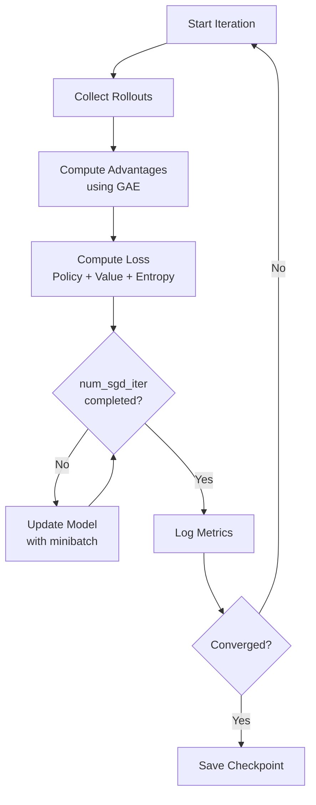

# Phân Tích Kỹ Thuật: Proximal Policy Optimization (PPO) trong MGMQ

Tài liệu này mô tả chi tiết về thuật toán **Proximal Policy Optimization (PPO)** được áp dụng trong dự án điều khiển đèn tín hiệu giao thông (ITS) sử dụng kiến trúc MGMQ (Multi-Graph Masking Q-Network approach adapted for Policy Gradient).

---

## 1. Tổng Quan

PPO là một thuật toán *On-policy Gradient* tìm cách cân bằng giữa:
1. **Ease of implementation:** Dễ cài đặt hơn TRPO.
2. **Sample efficiency:** Tận dụng dữ liệu tốt hơn.
3. **Ease of tuning:** Ít hyperparameter nhạy cảm hơn so với các thuật toán khác.

Trong dự án này, PPO được sử dụng để tối ưu hóa policy $\pi_\theta(a_t|s_t)$ nhằm điều khiển pha đèn giao thông cho 16 ngã tư (Agents) trong môi trường Grid 4x4.

---

## 2. Các Biến Thể Chính của PPO

Thuật toán PPO có hai biến thể phổ biến nhất:

### 2.1 PPO-Clip (Clipped Surrogate Objective)
- Đây là phiên bản được sử dụng trong dự án này và cũng là mặc định của RLlib, Stable-Baselines3, CleanRL...
- Sử dụng hàm loss với cơ chế "clipping" để giới hạn mức độ thay đổi của policy trong mỗi lần cập nhật.
- **Ưu điểm**: Đơn giản, hiệu quả, dễ tune hyperparameter.

### 2.2 PPO-Penalty (Adaptive KL Penalty)
- Thay vì clipping, PPO-Penalty thêm một thành phần penalty vào loss dựa trên độ lệch KL-divergence giữa policy mới và cũ:
  $$L^{Penalty}(\theta) = \mathbb{E}_t [r_t(\theta) \hat{A}_t - \beta \cdot KL[\pi_{old}, \pi_\theta]]$$
- $\beta$ là hệ số penalty, có thể được điều chỉnh động dựa trên mức độ KL-divergence thực tế.
- **Ưu điểm**: Kiểm soát chính xác hơn mức độ thay đổi của policy, nhưng khó tune.

### 2.3 So sánh nhanh
| Biến thể | Cơ chế ổn định | Dễ tune | Được dùng phổ biến |
|----------|---------------|---------|-------------------|
| PPO-Clip | Clipping      | Dễ      | ⭐⭐⭐⭐⭐             |
| PPO-Penalty | KL Penalty  | Khó     | ⭐                 |

**Kết luận:**
- PPO-Clip là lựa chọn mặc định cho hầu hết các framework RL hiện đại.
- PPO-Penalty chỉ dùng khi cần kiểm soát cực kỳ chặt chẽ về độ thay đổi policy.

---

## 3. PPO Objective Function (Hàm Mục Tiêu)

Hàm loss tổng quát của PPO trong project được tính như sau:

$$L_t(\theta) = \hat{\mathbb{E}}_t [ L_t^{CLIP}(\theta) - c_1 L_t^{VF}(\theta) + c_2 S[\pi_\theta](s_t) ]$$

Trong đó:
* $L_t^{CLIP}$: Policy Loss (tối ưu hành động).
* $L_t^{VF}$: Value Function Loss (tối ưu dự đoán phần thưởng).
* $S$: Entropy Bonus (khuyến khích khám phá).
* $c_1, c_2$: Các hệ số trọng số (`vf_loss_coeff`, `entropy_coeff`).

### 3.1. Clipped Surrogate Objective ($L^{CLIP}$)
Đây là thành phần cốt lõi giúp PPO hoạt động ổn định, ngăn chặn việc cập nhật policy quá mạnh làm "hỏng" những gì model đã học.

$$L^{CLIP}(\theta) = \hat{\mathbb{E}}_t [\min(r_t(\theta)\hat{A}_t, \text{clip}(r_t(\theta), 1-\epsilon, 1+\epsilon)\hat{A}_t)]$$

* **Ratio $r_t(\theta)$**: Tỷ lệ xác suất hành động mới so với cũ.
    $$r_t(\theta) = \frac{\pi_\theta(a_t|s_t)}{\pi_{\theta_{old}}(a_t|s_t)}$$
* **Advantage $\hat{A}_t$**: Lợi thế của hành động $a_t$ so với mức trung bình. Được tính bằng **GAE (Generalized Advantage Estimation)**.
* **Clipping $\epsilon$**: Giới hạn thay đổi. Trong config hiện tại: `clip_param: 0.2`.
    * Nghĩa là policy mới không được lệch quá 20% so với policy cũ trong một bước update đơn lẻ.

### 3.2. Value Function Loss ($L^{VF}$)
Để tính Advantage, ta cần một Value Function $V(s)$ ước lượng tổng phần thưởng tích lũy.

$$L^{VF} = (V_\theta(s_t) - V_t^{target})^2$$

* Config hiện tại: `vf_clip_param: 10.0`. Điều này giúp cắt bớt các giá trị loss quá lớn do nhiễu, tránh gradient bùng nổ.

### 3.3. Entropy Bonus ($S$)
Entropy đo lường độ ngẫu nhiên của policy.
* **Công thức:** $S = -\sum \pi(a|s) \log \pi(a|s)$
* **Mục đích:** Ngăn policy hội tụ quá sớm vào một phương án cục bộ (sub-optimal).
* Config hiện tại: `entropy_coeff: 0.02`.

---

## 4. Dirichlet Distribution cho Action Space

Một đặc điểm quan trọng của project này là sử dụng **Dirichlet Distribution** thay vì Gaussian cho action output.

### 4.1 Tại sao cần Dirichlet?

| Vấn đề với Gaussian | Giải pháp với Dirichlet |
|---------------------|------------------------|
| Output không đảm bảo sum = 1 | Tự động nằm trong simplex (sum = 1) |
| Cần post-processing (softmax) | Native simplex sampling |
| Scale Ambiguity | Concentration parameters trực quan |
| Vanishing Gradient | Stable gradients |

### 4.2 Cách hoạt động

```python
# Trong dirichlet_distribution.py
class DirichletDistribution:
    def __init__(self, concentration):
        # concentration: [batch, num_phases] > 0
        self.dist = torch.distributions.Dirichlet(concentration)
    
    def sample(self):
        # Returns: [batch, num_phases] with sum = 1.0
        return self.dist.sample()
    
    def log_prob(self, action):
        return self.dist.log_prob(action)
```

### 4.3 Concentration Parameters

| Concentration | Behavior |
|---------------|----------|
| α = [1, 1, 1, 1] | Uniform over simplex |
| α = [5, 5, 5, 5] | Concentrated around center |
| α = [10, 1, 1, 1] | Biased toward first phase |

### 4.4 Log-std vs Concentration

Với Dirichlet, thay vì `log_std` như Gaussian, ta có:
- `concentration = softplus(linear_output) + 1.0`
- Softplus đảm bảo concentration > 0
- +1.0 để tránh concentration quá nhỏ (spike at corners)

---

## 5. Cấu Hình Hyperparameters Thực Tế

Dựa trên file `model_config.yml`, đây là cấu hình đang chạy:

| Tham số | Giá trị | Ý nghĩa | Phân tích |
|---------|---------|---------|-----------|
| `gamma` | 0.99 | Discount Factor | Ưu tiên phần thưởng dài hạn. Phù hợp cho giao thông vì hành động hiện tại ảnh hưởng lâu dài. |
| `lambda_` | 0.95 | GAE Parameter | Cân bằng giữa Bias và Variance khi tính Advantage. 0.95 là giá trị tiêu chuẩn. |
| `learning_rate` | 0.0008 | Learning Rate | Cao hơn "hằng số vàng" 3e-4 một chút để học nhanh hơn. |
| `clip_param` | 0.2 | PPO Clip | Giới hạn thay đổi policy 20% mỗi update. |
| `vf_clip_param` | 10.0 | VF Clip | Clip value function loss. |
| `minibatch_size` | 64 | Batch Size cho SGD | Kích thước mẫu dùng để tính gradient. |
| `num_sgd_iter` | 10 | Epochs per Iteration | Số lần model học đi học lại trên cùng một batch. |
| `entropy_coeff` | 0.02 | Trọng số Entropy | Khuyến khích exploration. Có thể giảm khi model đã hội tụ. |
| `grad_clip` | 0.5 | Gradient Clipping | Ngăn gradient explosion. |

---

## 6. Kiến Trúc Model PPO-MGMQ

PPO trong dự án này không dùng mạng nơ-ron thẳng (MLP) thông thường mà sử dụng kiến trúc đồ thị (GNN) để trích xuất đặc trưng không gian:

### 6.1 High-level Architecture

```
┌──────────────────────────────────────────────────────────────┐
│                     MGMQ-PPO Model                           │
├──────────────────────────────────────────────────────────────┤
│                                                              │
│  1. Input Layer                                              │
│  ─────────────                                              │
│  Observation Dict:                                           │
│    - self_features: [B, T, 48]                              │
│    - neighbor_features: [B, K, T, 48]                       │
│    - neighbor_mask: [B, K]                                  │
│                                                              │
│  2. Encoder (LocalTemporalMGMQEncoder)                      │
│  ─────────────────────────────────────                      │
│    ├─→ DualStreamGATLayer (lane-level attention)            │
│    │     - Cooperation stream (same-phase lanes)            │
│    │     - Conflict stream (different-phase lanes)          │
│    │     - Multi-head attention (4 heads)                   │
│    │                                                        │
│    ├─→ DirectionalGraphSAGE (spatial aggregation)           │
│    │     - 5-direction projection (Self, N, E, S, W)        │
│    │     - Topology-aware neighbor pairing                  │
│    │                                                        │
│    └─→ TemporalGraphSAGE_BiGRU (temporal processing)        │
│          - Bi-directional GRU                               │
│          - Final network embedding                          │
│                                                              │
│  3. Joint Embedding                                          │
│  ─────────────────                                          │
│    concat(intersection_emb, network_emb) → [B, joint_dim]   │
│                                                              │
│  4. Policy Head (Actor)                                      │
│  ────────────────────                                       │
│    MLP [128, 64] → concentration_params [num_phases]        │
│    Dirichlet(concentration) → action (time ratios)          │
│                                                              │
│  5. Value Head (Critic)                                      │
│  ─────────────────────                                      │
│    MLP [128, 64] → V(s) scalar                              │
│                                                              │
└──────────────────────────────────────────────────────────────┘
```

### 6.2 Model Outputs

| Output | Shape | Mô tả |
|--------|-------|-------|
| `action_dist` | Dirichlet(B, 4) | Distribution over phase time ratios |
| `action_sample` | [B, 4] | Sampled action (sum = 1.0) |
| `action_log_prob` | [B] | Log probability of action |
| `value` | [B] | State value estimate |

### 6.3 Log-std Bounds (cho Gaussian backup)

```python
# Trong mgmq_model.py
SOFTMAX_LOG_STD_MIN = -5.0   # std = e^-5 ≈ 0.007 (very deterministic)
SOFTMAX_LOG_STD_MAX = -1.0   # std = e^-1 ≈ 0.37 (moderate exploration)
```

---

## 7. Các Metrics Quan Trọng Cần Theo Dõi

Khi training, cần quan sát các chỉ số sau trong Tensorboard hoặc console:

### 7.1 Primary Metrics

| Metric | Mục tiêu | Phân tích |
|--------|----------|-----------|
| `episode_reward_mean` | Tăng dần | Nếu không tăng → check reward function, learning rate |
| `episode_len_mean` | Ổn định | Nếu giảm → episodes ending early (bad policy) |
| `policy_loss` | Giảm rồi ổn định | Nếu không giảm → learning rate quá thấp |
| `vf_loss` | Giảm | Value function đang học |
| `entropy` | Giảm từ từ | Giảm quá nhanh → exploration không đủ |

### 7.2 PPO-specific Metrics

| Metric | Giá trị tốt | Cảnh báo |
|--------|-------------|----------|
| `kl` (KL Divergence) | 0.005 - 0.02 | > 0.05: policy changing too fast |
| `vf_explained_var` | > 0.5 | < 0.3: value function struggling |
| `approx_kl` | < `kl_target` | High: reduce learning rate |
| `clip_fraction` | 0.1 - 0.3 | > 0.5: clip_param too small |

### 7.3 Traffic-specific Metrics (Custom)

| Metric | Mô tả | Mục tiêu |
|--------|-------|----------|
| `total_waiting_time` | Tổng thời gian chờ | Giảm |
| `throughput` | Số xe đi qua/giờ | Tăng |
| `halting_vehicles` | Số xe đang dừng | Giảm |
| `average_speed` | Tốc độ TB | Tăng |

---

## 8. Training Loop Flow



---

## 9. Kết Luận

Setup PPO hiện tại đã được tinh chỉnh để phù hợp với bài toán Multi-Agent Traffic Control:

1. **Dirichlet Distribution**: Giải quyết vấn đề Scale Ambiguity và đảm bảo valid time ratios.

2. **DualStreamGATLayer**: Xử lý cả cooperation (same-phase) và conflict (different-phase) relationships giữa các lanes.

3. **Directional GraphSAGE**: Bảo toàn thông tin hướng của dòng giao thông.

4. **Temporal Processing với BiGRU**: Nắm bắt xu hướng giao thông theo thời gian.

5. **Appropriate Hyperparameters**: 
   - `learning_rate = 0.0008`: Đủ nhanh để học
   - `entropy_coeff = 0.02`: Exploration hợp lý
   - `clip_param = 0.2`: Stable updates
   - `grad_clip = 0.5`: Prevent gradient explosion

**Bước tiếp theo:** 
- Monitor `episode_reward_mean` qua các iterations
- Nếu reward không cải thiện, xem xét:
  - Giảm learning rate
  - Tăng entropy_coeff
  - Kiểm tra reward function weights
  - Tăng train_batch_size
