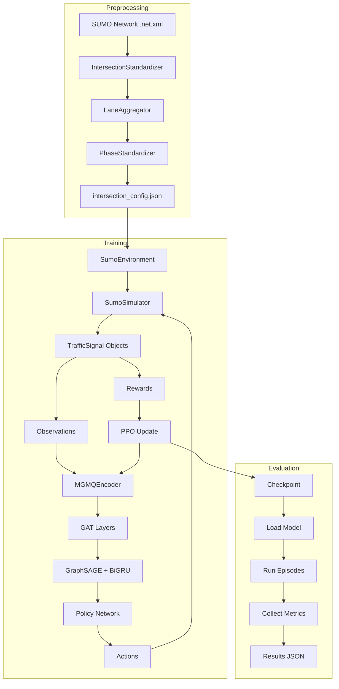

# Training và Testing Pipeline - MGMQ-PPO

Tài liệu này mô tả chi tiết quy trình training và testing cho hệ thống điều khiển đèn giao thông thích ứng MGMQ-PPO.

---

## Mục Lục

1. [Tổng Quan Pipeline](#1-tổng-quan-pipeline)
2. [Giai Đoạn 1: Preprocessing](#2-giai-đoạn-1-preprocessing)
3. [Giai Đoạn 2: Training](#3-giai-đoạn-2-training)
4. [Giai Đoạn 3: Evaluation](#4-giai-đoạn-3-evaluation)
5. [Chi Tiết Kiến Trúc](#5-chi-tiết-kiến-trúc)
6. [Sơ Đồ Luồng Dữ Liệu](#6-sơ-đồ-luồng-dữ-liệu)
7. [Troubleshooting](#7-troubleshooting)

---

## 1. Tổng Quan Pipeline

### 1.1. Pipeline Tổng Thể

```
┌──────────────────────────────────────────────────────────────────────┐
│                         MGMQ-PPO Pipeline                             │
├──────────────────────────────────────────────────────────────────────┤
│                                                                       │
│  ┌─────────────┐    ┌─────────────┐    ┌─────────────────────────┐  │
│  │   SUMO      │───►│Preprocessing│───►│      Training           │  │
│  │  Network    │    │  (GPI+FRAP) │    │  (PPO + MGMQ Model)     │  │
│  │  (.net.xml) │    │             │    │                         │  │
│  └─────────────┘    └──────┬──────┘    └───────────┬─────────────┘  │
│                            │                        │                │
│                            ▼                        ▼                │
│                    ┌───────────────┐        ┌─────────────┐         │
│                    │intersection_  │        │ Checkpoint  │         │
│                    │config.json    │        │   Model     │         │
│                    └───────────────┘        └──────┬──────┘         │
│                                                     │                │
│                                                     ▼                │
│                                             ┌─────────────┐         │
│                                             │  Evaluation │         │
│                                             │  & Deploy   │         │
│                                             └─────────────┘         │
│                                                                       │
└──────────────────────────────────────────────────────────────────────┘
```

### 1.2. Các File Chính

| Giai đoạn | Script | Input | Output |
|-----------|--------|-------|--------|
| Preprocessing | `scripts/preprocess_network.py` | `.net.xml` | `intersection_config.json` |
| Training | `scripts/train_mgmq_ppo.py` | Network files, Config | Checkpoint models |
| Evaluation | `scripts/eval_mgmq_ppo.py` | Checkpoint, Network | Metrics JSON |

---

## 2. Giai Đoạn 1: Preprocessing

### 2.1. Mục Đích

Preprocessing thực hiện chuẩn hóa mạng lưới giao thông để:
1. **Thống nhất cấu trúc** quan sát giữa các ngã tư khác nhau
2. **Ánh xạ hướng** (N/E/S/W) cho các làn xe
3. **Chuẩn hóa pha đèn** theo pattern chuẩn

### 2.2. Các Module

#### 2.2.1. GPI (General Plug-In) - `IntersectionStandardizer`

**Chức năng**: Ánh xạ các làn xe vào 4 hướng chuẩn (N, E, S, W).

```python
# File: src/preprocessing/standardizer.py

class IntersectionStandardizer:
    """
    Chuẩn hóa cấu trúc ngã tư bằng cách:
    1. Xác định tâm ngã tư
    2. Tính góc của mỗi edge đầu vào
    3. Ánh xạ vào hướng gần nhất (N/E/S/W)
    """
```

**Input**:
- Traffic light ID
- SUMO network file

**Output**:
```json
{
  "direction_map": {
    "N": "edge_from_north",
    "E": "edge_from_east",
    "S": "edge_from_south",
    "W": "edge_from_west"
  }
}
```

#### 2.2.2. Lane Aggregation - `LaneAggregator`

**Chức năng**: Đảm bảo tất cả ngã tư có cùng số lượng làn trong observation.

```python
# File: scripts/preprocess_network.py

class LaneAggregator:
    """
    Xử lý các trường hợp:
    - exact: Số làn = standard (giữ nguyên)
    - padded: Số làn < standard (thêm padding = 0)
    - merged: Số làn > standard (gộp bằng mean/max/sum)
    """
```

**Ví dụ**:
```
Ngã tư A: 3 làn mỗi hướng → merge thành 2 làn chuẩn
Ngã tư B: 1 làn mỗi hướng → pad thêm 1 làn (giá trị 0)
Ngã tư C: 2 làn mỗi hướng → giữ nguyên
```

#### 2.2.3. FRAP (Phase Standardizer)

**Chức năng**: Ánh xạ các pha đèn thực tế vào pattern pha chuẩn.

```python
# File: src/preprocessing/frap.py

class PhaseStandardizer:
    """
    4-phase standard pattern:
    - Phase 0: NS-Left (Bắc-Nam rẽ trái)
    - Phase 1: NS-Through (Bắc-Nam đi thẳng + rẽ phải)
    - Phase 2: EW-Left (Đông-Tây rẽ trái)
    - Phase 3: EW-Through (Đông-Tây đi thẳng + rẽ phải)
    """
```

### 2.3. Chạy Preprocessing

```bash
# Cơ bản
python scripts/preprocess_network.py --network grid4x4

# Chỉ một số ngã tư
python scripts/preprocess_network.py --network grid4x4 --ts-ids A0 A1 B0 B1

# Output tùy chỉnh
python scripts/preprocess_network.py --network grid4x4 --output ./custom_config.json
```

### 2.4. Output: `intersection_config.json`

```json
{
  "network_file": "network/grid4x4/grid4x4.net.xml",
  "num_intersections": 16,
  "intersections": {
    "A0": {
      "direction_map": {"N": null, "E": "A0B0", "S": "A0A1", "W": null},
      "lanes_by_direction": {
        "N": [],
        "E": ["A0B0_0", "A0B0_1"],
        "S": ["A0A1_0", "A0A1_1"],
        "W": []
      },
      "lane_aggregation": {
        "N": {"status": "missing", "mask": [0, 0]},
        "E": {"status": "exact", "mask": [1, 1]},
        "S": {"status": "exact", "mask": [1, 1]},
        "W": {"status": "missing", "mask": [0, 0]}
      },
      "phase_config": {
        "num_phases": 2,
        "phases": [...]
      }
    }
  },
  "adjacency": {
    "A0": [{"neighbor_id": "A1", "direction": "S"}]
  }
}
```

---

## 3. Giai Đoạn 2: Training

### 3.1. Tổng Quan Kiến Trúc Training

```
┌─────────────────────────────────────────────────────────────────────┐
│                         Training Architecture                        │
├─────────────────────────────────────────────────────────────────────┤
│                                                                       │
│  ┌─────────────────────────────────────────────────────────────┐    │
│  │                        Ray/RLlib                             │    │
│  │  ┌─────────────────┐    ┌─────────────────────────────┐     │    │
│  │  │   Ray Trainer   │    │      PPO Algorithm          │     │    │
│  │  │ (Orchestrator)  │───►│ - Policy Update             │     │    │
│  │  │                 │    │ - Value Update              │     │    │
│  │  └────────┬────────┘    │ - GAE Computation           │     │    │
│  │           │              └─────────────────────────────┘     │    │
│  │           │                                                   │    │
│  │           ▼                                                   │    │
│  │  ┌─────────────────────────────────────────────────────┐     │    │
│  │  │              Environment Workers                     │     │    │
│  │  │  ┌─────────┐ ┌─────────┐ ┌─────────┐ ┌─────────┐   │     │    │
│  │  │  │Worker 0 │ │Worker 1 │ │Worker 2 │ │Worker 3 │   │     │    │
│  │  │  │ (SUMO)  │ │ (SUMO)  │ │ (SUMO)  │ │ (SUMO)  │   │     │    │
│  │  │  └─────────┘ └─────────┘ └─────────┘ └─────────┘   │     │    │
│  │  └─────────────────────────────────────────────────────┘     │    │
│  └─────────────────────────────────────────────────────────────┘    │
│                                                                       │
│  ┌─────────────────────────────────────────────────────────────┐    │
│  │                     MGMQ Custom Model                        │    │
│  │  ┌───────────┐  ┌────────────────┐  ┌─────────────────┐     │    │
│  │  │    GAT    │──│  GraphSAGE     │──│  Policy/Value   │     │    │
│  │  │  Encoder  │  │  + Bi-GRU      │  │    Networks     │     │    │
│  │  └───────────┘  └────────────────┘  └─────────────────┘     │    │
│  └─────────────────────────────────────────────────────────────┘    │
│                                                                       │
└─────────────────────────────────────────────────────────────────────┘
```

### 3.2. Training Loop Chi Tiết

```python
# Pseudo-code của training loop

for iteration in range(num_iterations):
    # 1. Thu thập dữ liệu từ các workers
    rollouts = []
    for worker in workers:
        # Worker chạy SUMO simulation
        observations = sumo_env.reset()
        
        for step in range(rollout_fragment_length):
            # MGMQ model xử lý observations
            actions = mgmq_model.compute_actions(observations)
            
            # SUMO thực hiện actions
            next_obs, rewards, dones, infos = sumo_env.step(actions)
            
            rollouts.append((observations, actions, rewards, next_obs))
            observations = next_obs
    
    # 2. Tính toán advantages (GAE)
    advantages = compute_gae(rollouts, gamma, lambda_)
    
    # 3. PPO Update
    for epoch in range(num_sgd_iter):
        for minibatch in sample_minibatches(rollouts, minibatch_size):
            # Policy loss (clipped)
            policy_loss = compute_clipped_policy_loss(minibatch)
            
            # Value loss
            value_loss = compute_value_loss(minibatch)
            
            # Entropy bonus
            entropy = compute_entropy(minibatch)
            
            # Total loss
            loss = policy_loss + 0.5 * value_loss - entropy_coeff * entropy
            
            # Backpropagation
            optimizer.zero_grad()
            loss.backward()
            optimizer.step()
    
    # 4. Logging và Checkpoint
    if iteration % checkpoint_interval == 0:
        save_checkpoint()
```

### 3.3. Environment Wrapper

**Cấu trúc môi trường**:

```
SumoMultiAgentEnv (RLlib wrapper - src/environment/rllib_utils.py)
        │
        ▼
SumoEnvironment (Gym interface)
        │
        ▼
SumoSimulator (SUMO connection)
        │
        ├── TrafficSignal (per intersection)
        │       ├── Observation computation
        │       ├── Reward computation
        │       └── Action application
        │
        └── TraCI connection (to SUMO)
```

### 3.4. Observation Flow

```
┌────────────────────────────────────────────────────────────────────┐
│                         Observation Flow                            │
├────────────────────────────────────────────────────────────────────┤
│                                                                      │
│  SUMO Detectors                                                      │
│       │                                                              │
│       ▼                                                              │
│  ┌─────────────────────────────────────────────────────────────┐   │
│  │ TrafficSignal.update_detectors_history()                     │   │
│  │  - Mỗi 10s (sampling_interval): thu thập density, queue,    │   │
│  │    occupancy, speed từ E2 detectors                          │   │
│  │  - Lưu vào buffer history                                    │   │
│  └──────────────────────────┬──────────────────────────────────┘   │
│                              │                                       │
│                              ▼                                       │
│  ┌─────────────────────────────────────────────────────────────┐   │
│  │ TrafficSignal.compute_observation()                          │   │
│  │  - Tính trung bình trong window (delta_time)                 │   │
│  │  - Output: [density_1, ..., queue_1, ..., occ_1, ..., spd_1] │   │
│  │  - Shape: [4 * num_detectors]                                │   │
│  └──────────────────────────┬──────────────────────────────────┘   │
│                              │                                       │
│                              ▼                                       │
│  ┌─────────────────────────────────────────────────────────────┐   │
│  │ History stacking (if window_size > 1)                        │   │
│  │  - Stack observations over time                              │   │
│  │  - Shape: [window_size * 4 * num_detectors]                  │   │
│  └──────────────────────────┬──────────────────────────────────┘   │
│                              │                                       │
│                              ▼                                       │
│  ┌─────────────────────────────────────────────────────────────┐   │
│  │ MGMQ Model Input                                             │   │
│  │  - Reshape to [batch, agents, window_size, features]         │   │
│  └─────────────────────────────────────────────────────────────┘   │
│                                                                      │
└────────────────────────────────────────────────────────────────────┘
```

### 3.5. Action Flow

```
┌────────────────────────────────────────────────────────────────────┐
│                           Action Flow                               │
├────────────────────────────────────────────────────────────────────┤
│                                                                      │
│  MGMQ Model Output                                                   │
│       │                                                              │
│       ▼                                                              │
│  ┌─────────────────────────────────────────────────────────────┐   │
│  │ Action: Continuous vector [num_phases]                       │   │
│  │  - Mỗi element = tỷ lệ thời gian xanh cho pha đó            │   │
│  │  - Ví dụ: [0.25, 0.35, 0.15, 0.25]                          │   │
│  └──────────────────────────┬──────────────────────────────────┘   │
│                              │                                       │
│                              ▼                                       │
│  ┌─────────────────────────────────────────────────────────────┐   │
│  │ TrafficSignal._get_green_time_from_ratio()                   │   │
│  │  1. Normalize: action / sum(action)                          │   │
│  │  2. Scale: normalized * total_green_time                     │   │
│  │  3. Clip: ensure >= min_green                                │   │
│  │  - Output: [15, 25, 10, 20] giây                             │   │
│  └──────────────────────────┬──────────────────────────────────┘   │
│                              │                                       │
│                              ▼                                       │
│  ┌─────────────────────────────────────────────────────────────┐   │
│  │ TrafficSignal.set_next_phase()                               │   │
│  │  - Gọi SUMO API: setProgramLogic()                           │   │
│  │  - Cập nhật phase durations                                  │   │
│  └──────────────────────────┬──────────────────────────────────┘   │
│                              │                                       │
│                              ▼                                       │
│  ┌─────────────────────────────────────────────────────────────┐   │
│  │ SUMO Execution                                               │   │
│  │  - Chạy simulation với timing mới                            │   │
│  │  - Tự động chuyển phases theo durations đã set               │   │
│  └─────────────────────────────────────────────────────────────┘   │
│                                                                      │
└────────────────────────────────────────────────────────────────────┘
```

### 3.6. Reward Function

**Default reward: Multi-reward system**

Hệ thống sử dụng kết hợp nhiều reward functions với trọng số bằng nhau:

```python
# Default config trong model_config.yml
reward:
  functions:
    - halt-veh-by-detectors  # Phạt xe dừng/kẹt
    - diff-departed-veh      # Thưởng xe thoát khỏi giao lộ
    - occupancy              # Cân bằng mật độ chiếm dụng
  weights: null  # Auto-compute equal weights
```

```python
def _diff_waiting_time_reward(self):
    """
    Reward = (waiting_time_previous) - (waiting_time_current)
    
    - Positive: Waiting time giảm (tốt)
    - Negative: Waiting time tăng (xấu)
    - Normalized by /100 để scale phù hợp
    """
    ts_wait = sum(self.get_accumulated_waiting_time_per_lane()) / 100.0
    reward = self.last_ts_waiting_time - ts_wait
    self.last_ts_waiting_time = ts_wait
    return reward
```

**Các reward functions khác**:

| Function | Ý nghĩa |
|----------|---------|
| `queue` | Số xe đang dừng (âm) |
| `average-speed` | Tốc độ trung bình (dương) |
| `pressure` | Chênh lệch xe vào/ra |

### 3.7. Chạy Training

```bash
# Cơ bản
python scripts/train_mgmq_ppo.py --network grid4x4 --workers 2

# Đầy đủ options
python scripts/train_mgmq_ppo.py \
  --network grid4x4 \
  --iterations 300 \
  --workers 4 \
  --gpu \
  --learning-rate 1e-4 \
  --gat-hidden-dim 64 \
  --gat-num-heads 4 \
  --graphsage-hidden-dim 64 \
  --history-length 5 \
  --experiment-name "mgmq_grid4x4_experiment1" \
  --output-dir ./results_mgmq
```

### 3.8. Output Training

```
results_mgmq/
└── mgmq_ppo_grid4x4_20251227_153000/
    ├── checkpoint_000020/
    │   ├── algorithm_state.pkl
    │   ├── policies/
    │   └── rllib_checkpoint.json
    ├── checkpoint_000040/
    ├── ...
    ├── mgmq_training_config.json  # Cấu hình đã dùng
    ├── params.pkl
    ├── progress.csv               # Metrics theo iteration
    └── result.json
```

---

## 4. Giai Đoạn 3: Evaluation

### 4.1. Evaluation Flow

```
┌────────────────────────────────────────────────────────────────────┐
│                         Evaluation Flow                             │
├────────────────────────────────────────────────────────────────────┤
│                                                                      │
│  ┌─────────────┐     ┌─────────────┐     ┌─────────────────┐       │
│  │ Load        │────►│  Create     │────►│  Run Episodes   │       │
│  │ Checkpoint  │     │  Env        │     │                 │       │
│  └─────────────┘     └─────────────┘     └────────┬────────┘       │
│                                                    │                │
│                                                    ▼                │
│                                           ┌─────────────────┐       │
│                                           │  Collect        │       │
│                                           │  Metrics        │       │
│                                           └────────┬────────┘       │
│                                                    │                │
│                                                    ▼                │
│                                           ┌─────────────────┐       │
│                                           │  Save Results   │       │
│                                           │  (JSON)         │       │
│                                           └─────────────────┘       │
│                                                                      │
└────────────────────────────────────────────────────────────────────┘
```

### 4.2. Chạy Evaluation

```bash
# Cơ bản
python scripts/eval_mgmq_ppo.py \
  --checkpoint results_mgmq/experiment_name/checkpoint_000100

# Với GUI SUMO
python scripts/eval_mgmq_ppo.py \
  --checkpoint results_mgmq/experiment_name/checkpoint_000100 \
  --network grid4x4 \
  --episodes 10 \
  --gui \
  --output evaluation_results.json
```

### 4.3. Output Metrics

```json
{
  "mean_reward": -125.5,
  "std_reward": 15.2,
  "min_reward": -150.0,
  "max_reward": -95.0,
  "mean_length": 40.0,
  "mean_waiting_time": 45.3,
  "std_waiting_time": 8.7,
  "episode_rewards": [-120.5, -130.2, ...],
  "episode_lengths": [40, 40, ...]
}
```

### 4.4. Các Metrics Quan Trọng

| Metric | Ý nghĩa | Mong muốn |
|--------|---------|-----------|
| `mean_reward` | Reward trung bình | Càng cao càng tốt (ít âm hơn) |
| `mean_waiting_time` | Thời gian chờ TB (giây) | Càng thấp càng tốt |
| `system_mean_speed` | Tốc độ TB (m/s) | Càng cao càng tốt |
| `system_total_stopped` | Số xe dừng | Càng thấp càng tốt |

---

## 5. Chi Tiết Kiến Trúc

### 5.1. MGMQ Model Architecture

```
┌─────────────────────────────────────────────────────────────────────┐
│                         MGMQ Model                                   │
├─────────────────────────────────────────────────────────────────────┤
│                                                                       │
│  Input: obs [batch, agents, window_size * 4 * num_lanes]             │
│                                                                       │
│  ┌────────────────────────────────────────────────────────────────┐ │
│  │              Layer 1: Intersection Embedding                    │ │
│  │  ┌─────────────────────────────────────────────────────────┐   │ │
│  │  │ Input Projection: [lane_features] → [gat_hidden_dim]    │   │ │
│  │  └─────────────────────────────────────────────────────────┘   │ │
│  │                          │                                      │ │
│  │            ┌─────────────┴─────────────┐                       │ │
│  │            ▼                           ▼                        │ │
│  │  ┌─────────────────────┐    ┌─────────────────────┐            │ │
│  │  │   GAT Cooperation   │    │    GAT Conflict     │            │ │
│  │  │ (4 heads, 32 dim)   │    │  (4 heads, 32 dim)  │            │ │
│  │  └──────────┬──────────┘    └──────────┬──────────┘            │ │
│  │             └──────────┬───────────────┘                        │ │
│  │                        ▼                                        │ │
│  │              ┌─────────────────────┐                            │ │
│  │              │ Concat + Lane Pool  │                            │ │
│  │              │ [256 dim per agent] │                            │ │
│  │              └──────────┬──────────┘                            │ │
│  └──────────────────────────┼───────────────────────────────────┘  │
│                              │                                       │
│  ┌───────────────────────────▼───────────────────────────────────┐ │
│  │              Layer 2: Network Embedding                        │ │
│  │  ┌─────────────────────────────────────────────────────────┐   │ │
│  │  │ GraphSAGE + Bi-GRU                                       │   │ │
│  │  │ - Spatial: Aggregate từ neighbors                        │   │ │
│  │  │ - Temporal: Process over time steps                      │   │ │
│  │  │ - Output: [64 dim]                                       │   │ │
│  │  └─────────────────────────────────────────────────────────┘   │ │
│  └────────────────────────────┬──────────────────────────────────┘ │
│                                │                                     │
│  ┌─────────────────────────────▼─────────────────────────────────┐ │
│  │              Layer 3: Joint Embedding + Heads                  │ │
│  │                                                                 │ │
│  │  ┌──────────────────────────────────────────────────────────┐  │ │
│  │  │ Joint = Concat(Intersection_emb, Network_emb)            │  │ │
│  │  │ Shape: [256 + 64 = 320 dim]                              │  │ │
│  │  └────────────────────────┬─────────────────────────────────┘  │ │
│  │                           │                                     │ │
│  │            ┌──────────────┴──────────────┐                     │ │
│  │            ▼                              ▼                     │ │
│  │  ┌──────────────────┐          ┌──────────────────┐            │ │
│  │  │  Policy Network  │          │  Value Network   │            │ │
│  │  │  [128 → 64 → 4]  │          │  [128 → 64 → 1]  │            │ │
│  │  └────────┬─────────┘          └────────┬─────────┘            │ │
│  │           │                              │                      │ │
│  │           ▼                              ▼                      │ │
│  │     action_mean                     state_value                 │ │
│  │     action_std                                                  │ │
│  └─────────────────────────────────────────────────────────────────┘ │
│                                                                       │
└─────────────────────────────────────────────────────────────────────┘
```

### 5.2. GAT Layer Detail

**Cooperation Graph**:
```
Các làn xe di chuyển cùng pha được kết nối:
- Phase 1 (NS-Left): Lanes 0, 6 (NL, SL)
- Phase 2 (NS-Through): Lanes 1, 7, 2, 8 (NT, ST, NR, SR)
- Phase 3 (EW-Left): Lanes 3, 9 (EL, WL)
- Phase 4 (EW-Through): Lanes 4, 10, 5, 11 (ET, WT, ER, WR)
```

**Conflict Graph**:
```
Các làn xe có quỹ đạo xung đột được kết nối:
- NS-Through vs EW-Through: (1,4), (1,10), (7,4), (7,10)
- Through vs Crossing-Left: (1,3), (1,9), (7,3), (7,9), ...
- Left vs Opposing-Through: (0,7), (6,1), (3,10), (9,4)
```

### 5.3. GraphSAGE Aggregation

```python
# Pseudo-code cho Directional GraphSAGE aggregation

def aggregate_neighbors(node_features, adjacency):
    """
    Tổng hợp features từ các ngã tư lân cận theo hướng
    
    Args:
        node_features: [batch, num_nodes, feature_dim]
        adjacency: [num_nodes, num_nodes]
    """
    # 1. Directional Projection (Self, N, E, S, W)
    g_self  = proj_self(node_features)
    g_north = proj_north(node_features)
    g_east  = proj_east(node_features)
    g_south = proj_south(node_features)
    g_west  = proj_west(node_features)
    
    # 2. Neighbor Sampling (Flow Pairing)
    # Output South của hàng xóm -> Input North của mình
    in_north = adjacency @ g_south
    in_east  = adjacency @ g_west
    in_south = adjacency @ g_north
    in_west  = adjacency @ g_east
    
    # 3. Bi-GRU Aggregation
    # Tạo chuỗi vector hướng
    sequence = [in_north, in_east, in_south, in_west, g_self]
    
    # Feed qua Bi-GRU
    output, _ = bigru(sequence)
    
    return output_linear(output)
```

---

## 6. Sơ Đồ Luồng Dữ Liệu

### 6.1. End-to-End Data Flow



### 6.2. Multi-Agent Coordination

```
┌─────────────────────────────────────────────────────────────────────┐
│                    Multi-Agent Environment                           │
├─────────────────────────────────────────────────────────────────────┤
│                                                                       │
│  ┌─────────────┐  ┌─────────────┐  ┌─────────────┐  ┌─────────────┐ │
│  │     A0      │──│     A1      │──│     A2      │──│     A3      │ │
│  │   Agent     │  │   Agent     │  │   Agent     │  │   Agent     │ │
│  └──────┬──────┘  └──────┬──────┘  └──────┬──────┘  └──────┬──────┘ │
│         │                │                │                │         │
│         │                │                │                │         │
│  ┌──────▼──────┐  ┌──────▼──────┐  ┌──────▼──────┐  ┌──────▼──────┐ │
│  │     B0      │──│     B1      │──│     B2      │──│     B3      │ │
│  └──────┬──────┘  └──────┬──────┘  └──────┬──────┘  └──────┬──────┘ │
│         │                │                │                │         │
│         │       ┌────────┴────────┐       │                │         │
│  ┌──────▼───────▼────┐  ┌─────────▼───────▼──────┐        │         │
│  │     C0            │──│     C1                 │──...    │         │
│  └───────────────────┘  └────────────────────────┘                   │
│                                                                       │
│  Mỗi agent:                                                          │
│  - Nhận observation riêng (local traffic state)                      │
│  - Nhận thông tin từ neighbors qua GraphSAGE                         │
│  - Quyết định action riêng (green times)                             │
│  - Nhận reward riêng (local waiting time reduction)                  │
│                                                                       │
└─────────────────────────────────────────────────────────────────────┘
```

---

## 7. Troubleshooting

### 7.1. Lỗi Thường Gặp

#### SUMO Connection Error

```
Error: SUMO connection failed
```

**Nguyên nhân**: SUMO chưa cài đặt hoặc SUMO_HOME chưa được set.

**Giải pháp**:
```bash
# Kiểm tra SUMO
export SUMO_HOME=/usr/share/sumo  # Linux
echo $SUMO_HOME

# Test SUMO
sumo --version
```

#### Memory Error

```
ray.exceptions.RayOutOfMemoryError
```

**Nguyên nhân**: Quá nhiều workers hoặc batch size quá lớn.

**Giải pháp**:
```bash
# Giảm workers
python scripts/train_mgmq_ppo.py --workers 1

# Hoặc tăng memory limit trong code:
ray.init(object_store_memory=int(1e9))  # 1GB
```

#### Observation Space Mismatch

```
AssertionError: observation out of bounds
```

**Nguyên nhân**: Detector configuration không khớp với observation space.

**Giải pháp**:
1. Kiểm tra `detector.add.xml` có đủ E2 detectors
2. Chạy lại preprocessing

#### NaN Rewards

```
WARNING: NaN rewards detected
```

**Nguyên nhân**: Division by zero hoặc invalid state.

**Giải pháp**: Code đã tự động xử lý bằng cách replace NaN với 0.0.

### 7.2. Tips Debug

1. **Enable SUMO GUI** để visualize:
   ```bash
   python scripts/train_mgmq_ppo.py --gui
   ```

2. **Reduce iterations** để test nhanh:
   ```bash
   python scripts/train_mgmq_ppo.py --iterations 5 --workers 1
   ```

3. **Check logs**:
   ```bash
   cat results_mgmq/experiment_name/progress.csv
   ```

4. **Verify network files**:
   ```bash
   python verify_route.py  # Kiểm tra routes
   python verify_setup.py  # Kiểm tra toàn bộ setup
   ```

---

